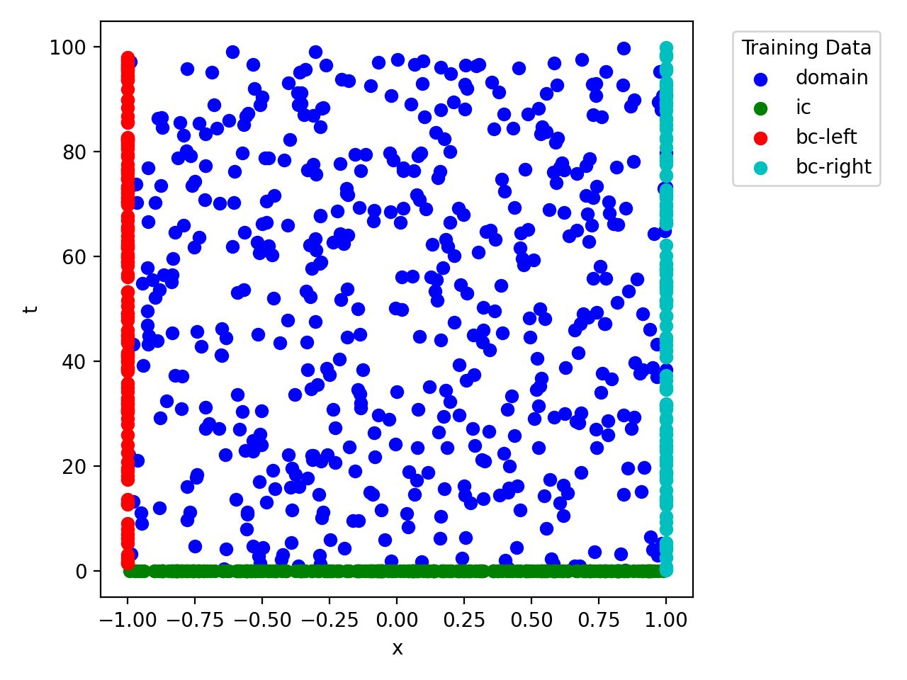
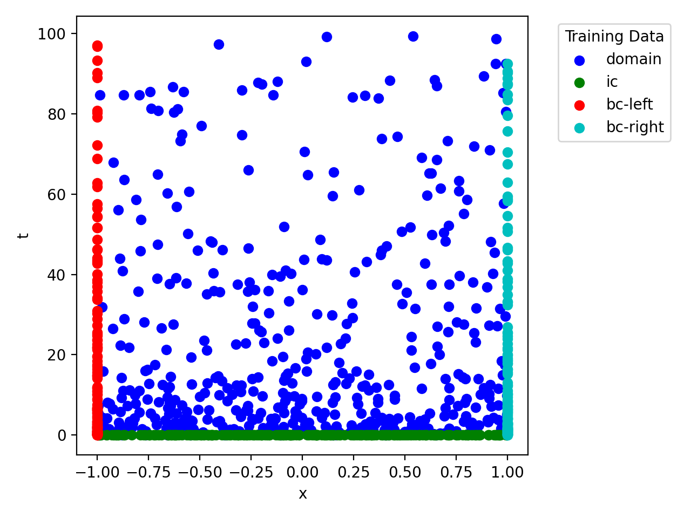

# A guide for generating collocation grid for PINN solvers 

Training PINNs is not a trivial optimization problem because it consists of multiple objectives (PDE, IC, BC). The optimizer performs best when each loss term is sampled correctly and equally during each mini-batch training. This implies that our fed collocation grid should contain enough sample points for each loss term, e.g. on the boundary or in the domain, so that each mini-batch contains information for all loss terms.


The code `sciann-datagenerator.py` includes the following classes:
- DataGeneratorX: Generate 1D collocation grid. 
- DataGeneratorXY: Generate 2D collocation grid for a rectangular domain. 
- DataGeneratorXT: Generate 1D time-dependent collocation grid. 
- DataGeneratorXYT: Generate 2D time-dependent collocation grid for a rectangular domain.

For more complex geometries/problems, you should follow a similar approach to generate a proper collocation grid for training PINNs. As an example, for a complex 3D geometry, if you have a mesh that contains `N` points inside the domain, generate a second finer mesh that contains roughly the same number of nodes on the boundary. Then, concatenate them all in one large data set and assign proper `ids` for `domain` and `boundary` nodes. 

## How to use this code: 

Let us assume you want to solve a 1D time-dependent problem with $x\in[0, 1]$ and $t\in[0, 10]$. Additonally, let us assume that your `SciModel` is defined as follows:

```python
m = sn.SciModel([x, t], [PDE, IC, BC_left, BC_right])
```

You can then use `DataGeneratorXT` to generate a proper collocation grid for training your PINN model, as:

```python
dg = DataGeneratorXT(
    X=[0., 1.],
    T=[0., 10.],
    targets=["domain", "ic", "bc-left", "bc-right"],
    num_sample=1_000,
    logT=False
)
```

This code generates roughly `1,000` collocation points for training your PINN model. Note that the order and type of  `targets` defined in `SciModel` should be the same for the  `DataGeneratorXT`. You can test your generated collocation grid as:

```python
dg.plot_data()
```



For some problems, the training may converge faster if you generate time samples in a logarithmic distribution. In that case, we have: 


```python
dg = DataGeneratorXT(
    X=[0., 1.],
    T=[0., 10.],
    targets=["domain", "ic", "bc-left", "bc-right"],
    num_sample=1_000,
    logT=True
)
dg.plot_data()
```




# Useful?  

If you found this document useful, please support us by `star`ing our repository and citing our `SciANN` paper: 

```
@article{haghighat2021sciann,
  title={SciANN: A Keras/TensorFlow wrapper for scientific computations and physics-informed deep learning using artificial neural networks},
  author={Haghighat, Ehsan and Juanes, Ruben},
  journal={Computer Methods in Applied Mechanics and Engineering},
  volume={373},
  pages={113552},
  year={2021},
  publisher={Elsevier}
}
```